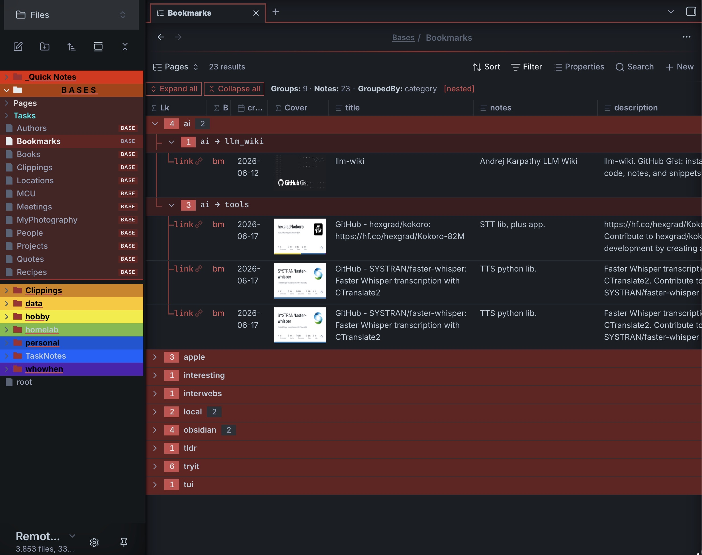
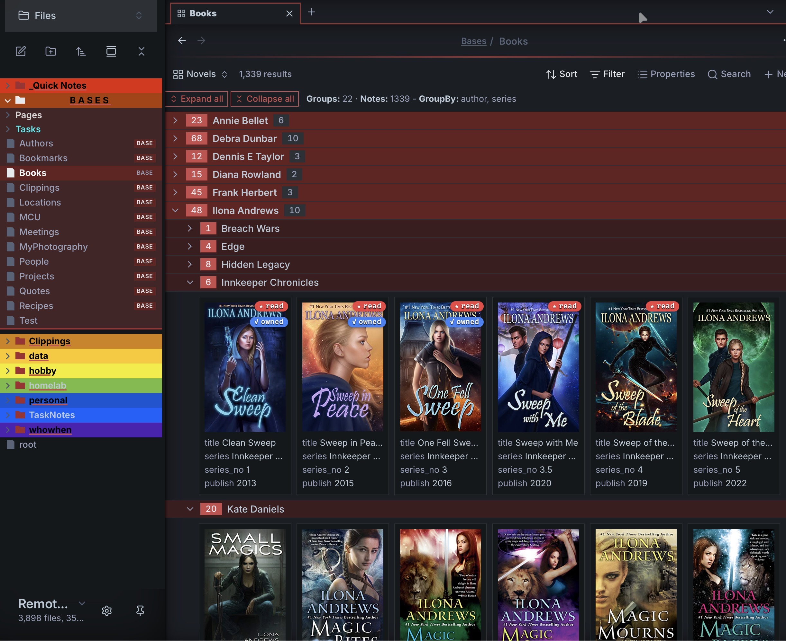
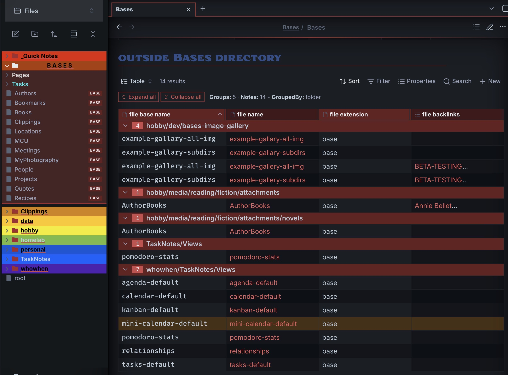
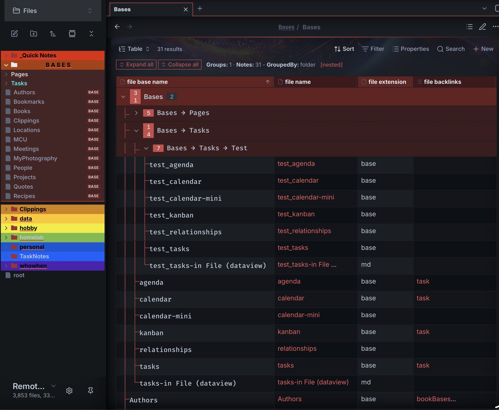

---
parent:
  - "[[dev]]"
---


# Collapsing Group Table

_Bases Table & Card views that support collapsable grouping._





Two [Bases](https://obsidian.md/help/bases) Table and Card view for [Obsidian](https://obsidian.md/) that turns grouped results into a **collapsible tree** — fold and unfold groups like branches, optional support for nested hierarchical groups from a single `/`-delimited property, and edit your notes inline.

It adds new Bases and Card types that can be use in places of the Obsidian Bases Table and Card views with one that supports collapsable row groups based off GroupBy column set in the Bases configuration, or additional columns set in Bases config dialog.   **NEW:** Card view now support property badges.  You can now, for example, mark books as “read”, “owned”, or “loaned-out”.  By setting a badge property and it having a non-false value.



  They also supports optional nested categories, for example:  ”research/medical”  or multiple columns and a number of new useful behaviors (example: accordion) .  It tries to be a drop-in replacement for both the Obsidian Bases Table and Card views… tries to be (since Obsidian did not provide an extendible BaseTable object, several things had to be code from scratch, so somethings may vary).  If you turn on nested groupBy keys, then it support up to multiple levels of nesting (example “art/painting/water_color” )


* MOC example above.

## Requirements
- [Obsidian](https://obsidian.md/) `(ver >= 1.10.2)` — the Bases core plugin must be available.

## Installation
### Community plugin
Search for **Collapsing Group Table** in Settings → Community plugins → Browse.

### BRAT (beta)
1. In Obsidian, install and enable **BRAT** (Settings → Community plugins → Browse).
2. Settings → **BRAT** → **Add beta plugin**.
3. Enter the repository `ghyatt/bases-collapsing-group-table` and click **Add Plugin**.
4. Enable **Collapsing Group Table** under Settings → Community plugins.

## Usage
1. Create or open a Base.
2. Add a view and choose **Collapsing group table** or **Collapsing group cards**.
3. Set a **Group by** property in the Base's view options — this becomes the foldable branch.
4. Click a group header (or its chevron) to fold/unfold it.

If no **Group by** is set, the view renders as a plain table / card grid. Which rows appear, the column order, and the sort all come from the **Base's own** settings.

## Collapsing & groups
- **Click a group header** — collapse or expand that group; closing a group also closes its sub-groups.
- **Expand all / Collapse all** — buttons in the control bar (which also shows **Groups**, **Notes**, the **GroupBy** columns, and a `[nested]` tag).
- **Accordion mode** — expanding one top group collapses the others (only one open at a time).
- **Start with groups collapsed** — open with everything folded.
- Group headers show an **entry-count** badge, and a **sub-group count** badge when a group has more than one sub-group.

### Nested groups
There are two ways to nest, and they're mutually exclusive.

**Split groupBy value on "/" to nest** — turn on the toggle and any group value containing `/` is split into a nested tree, to arbitrary depth. For example, grouping by a `category` whose values are `ai/llm_wiki`, `ai/tools`, `obsidian/plugin` produces:

```
▾ ai
   ▾ ai → llm_wiki
   ▾ ai → tools
▾ obsidian
   ▾ obsidian → plugin
```

**Sub-group by columns** — instead of the `/` split, pick **Sub-group by (2nd level)** / **(3rd level)** properties to nest by those columns (values used whole, never split).

**When opening a group** controls what the sub-groups do on open (and on initial load): open the **first** sub-group, **all** of them, or **none**.

### Situational options — strip a prefix (folder MOCs)
When nesting is on, **Strip prefix from values** removes a leading prefix from each group value *before* the `/` split, so a folder-based Map of Content shows clean relative paths. Enter either a **literal path** (e.g. `hobby/media`), or the formula **`this.file.folder`**, which resolves to the base's own containing folder — so an embedded base strips its own folder with no path to type, and keeps working if you move it. Files that sit directly in the stripped folder render at the **top, ungrouped**; sub-folders become the top-level groups.

## Inline editing (table view)
In the table view, click a cell backed by a note property to edit it; changes are written to the note's frontmatter.

- **Checkbox** — boolean properties render an editable checkbox.
- **Text** — opens a multi-line editor sized to the row height.
- **Number / Date** — single-line editors (date uses a date picker).
- **Tags / link lists** — items render as native tag pills / clickable links, each with a × to remove; click the cell to add more, with **autocomplete** of existing vault tags or pages.
- **File name** renders as a clickable link to the note.

## Layout
- **Row height** — Short / Medium / Tall / Extra tall (1 / 3 / 6 / 12 lines) or Dynamic; image cells scale to match.
- **Resizable columns** — drag a column header's right edge; **double-click** it to auto-fit. Widths are shared with the built-in Table view (`columnSize`).
- Headers show a **type icon**, the **column name**, and the current **sort direction** arrow.
- **Date format** — optionally format date cells with [moment](https://momentjs.com/docs/#/displaying/format/) tokens (e.g. `YYYY-MM-DD`).

Your fold state and column widths are saved into the `.base` file, so they survive reloads.

## Cards view
The **Collapsing group cards** view renders entries as cards (cover image + title + fields) with the same collapsible grouping, nesting, accordion, and strip-prefix behaviour. It reads the built-in Cards view's settings (`image`, `cardSize`, `imageAspectRatio`, `imageFit`), so an existing `type: cards` view can be switched over — or set them via the view options:

- **Card image property** — the property used as the cover.
- **Card width** — card size in px.
- **Image fit** — `cover` (crop to fill) or `contain` (whole image), paired with **Image aspect ratio** (height ÷ width; 0 = natural) for uniform covers.
- **Filename** — show below the cover, hide, or overlay on the cover (revealed on hover).

The cover and filename are clickable to open the note.

### Card badges
Flag up to **4 columns** as badges. When a card's value for that column is **truthy** (checked box, non-empty text, non-zero number, non-empty list), a coloured pill appears at the card's **top-right** showing a slot symbol and the column name — e.g. a `read` checkbox shows `★ read`. Each of the four slots has a **fixed position, symbol, and colour** (① ★ ② ✓ ③ ◆ ④ ●), so a column always sits in the same spot across every card; a slot with no value leaves its place blank rather than shifting the others.

## Configuration
Options are set from the Base **view configuration** menu, grouped into sections. A vault-wide default lives in the plugin's settings tab.

**Grouping & nesting** (both views)

| Option | Default | Description |
| --- | --- | --- |
| Accordion mode | off | Expanding a top group collapses the others. |
| Start with groups collapsed | off | Open with all groups folded. |
| Show entry count on group headers | on | Show the entry-count badge. |
| Split groupBy value on "/" to nest | off | Split `/`-delimited group values into a nested tree. |
| Sub-group by (2nd / 3rd level) | — | Nest by additional columns (mutually exclusive with the "/" split). |
| When opening a group | First sub-group | On open, expand the first / all / no sub-groups. |

**Situational options** (both views; shown only when nesting is on)

| Option | Default | Description |
| --- | --- | --- |
| Strip prefix from values | — | Remove a leading prefix before the "/" split. A literal path, or a formula like `this.file.folder` to strip the base's own folder. |

**Table**

| Option | Default | Description |
| --- | --- | --- |
| Row height | Short | Short / Medium / Tall / Extra tall / Dynamic. |
| Date format | (plugin default) | moment.js tokens applied to date cells; blank inherits the plugin setting. |

**Cards**

| Option | Default | Description |
| --- | --- | --- |
| Card image property | — | Property used as the cover. |
| Card width | 240 px | Card width. |
| Filename | Show | Show below image / Hide / Overlay on hover. |
| Image fit | Cover | Cover (crop to fill) or Contain (whole image). |
| Image aspect ratio | 0 (natural) | Height ÷ width for uniform covers. |
| Badge 1–4 | — | Columns shown as coloured top-right badges when truthy (fixed slot, symbol, colour). |
| Date format | (plugin default) | moment.js tokens applied to date fields; blank inherits the plugin setting. |

**Plugin settings** (Settings → Community plugins → Collapsing Group Table)

| Setting | Default | Description |
| --- | --- | --- |
| Default date format | — | Vault-wide moment.js date format; a per-view Date format overrides it. |
| Show what's new on update | on | Open the changelog popup after an update. |

## License
[MIT](LICENSE) — provided as is. File bugs or feature requests on [GitHub](https://github.com/ghyatt/bases-collapsing-group-table/issues).

## Bugs
- Please reports any issues at the GitHub issues for [Obsidian Collapsable Table Base](https://github.com/ghyatt/bases-collapsing-group-table)

